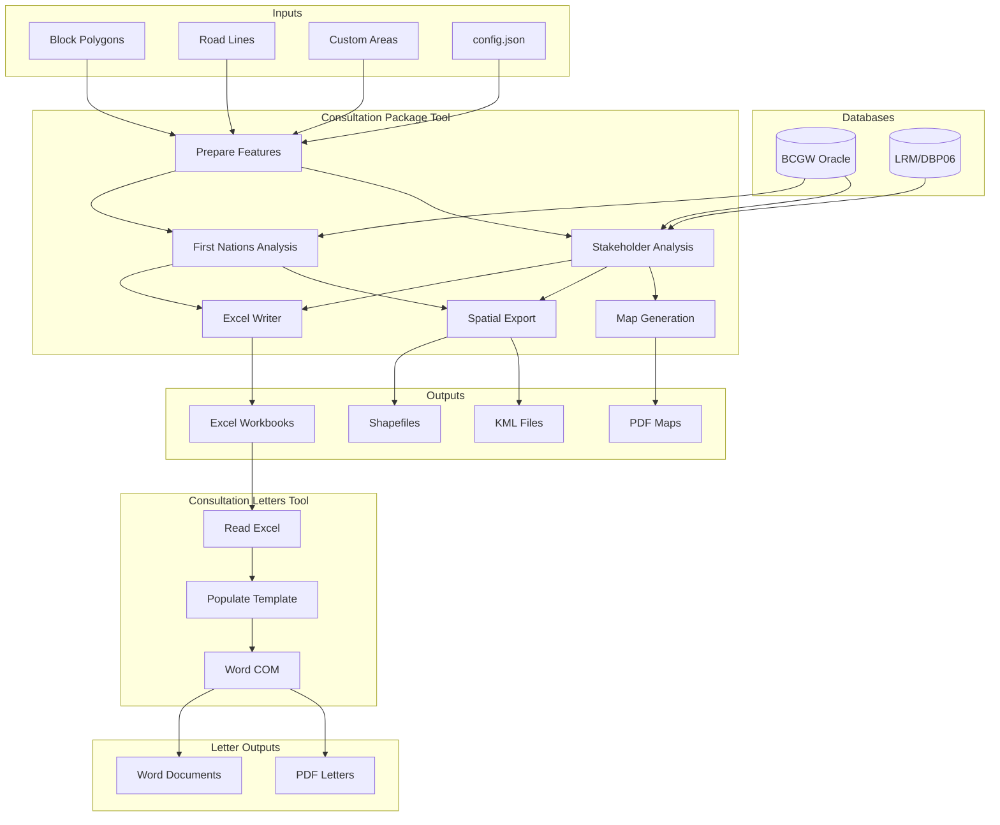
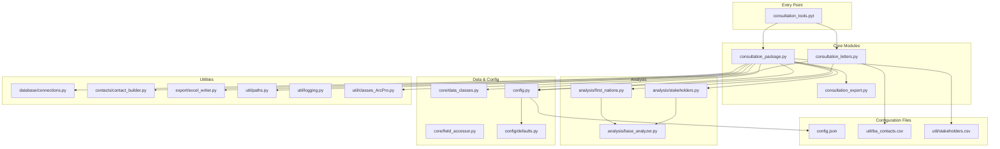
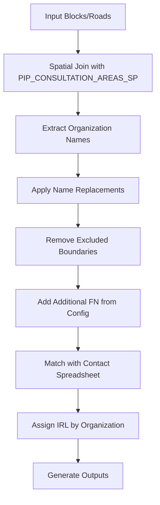
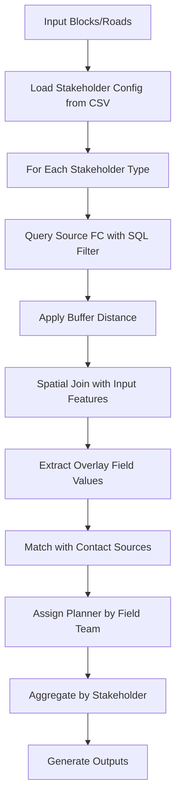

# BCTS Consultation Tools

ArcGIS Pro Python toolbox for generating First Nations and Stakeholder consultation packages, including contact lists, spatial exports, maps, and letters.

## Table of Contents

- [Overview](#overview)
- [Quick Start Checklist](#quick-start-checklist)
- [Architecture](#architecture)
- [Configuration Reference](#configuration-reference)
- [Transfer Guide](#transfer-guide)
- [Tool Parameters Reference](#tool-parameters-reference)
- [Output Reference](#output-reference)
- [Business Logic Reference](#business-logic-reference)
- [Troubleshooting Guide](#troubleshooting-guide)
- [Maintenance Checklist](#maintenance-checklist)
- [Appendices](#appendices)

---

## Overview

### Purpose

These tools automate the generation of consultation packages for BCTS (BC Timber Sales) business areas. The toolbox:

1. **Analyzes spatial overlaps** between proposed forestry operations (blocks/roads) and First Nations consultation areas or stakeholder interests
2. **Generates Excel workbooks** with contact information and consultation details
3. **Exports spatial data** as shapefiles and KML files for distribution
4. **Creates PDF maps** showing consultation areas (stakeholders only)
5. **Produces consultation letters** from Word templates with automatic PDF conversion

### Target Audience

- BCTS Planning staff responsible for First Nations and stakeholder consultations
- GIS analysts configuring tools for new business areas
- IT staff deploying the toolbox to shared network locations

### Key Capabilities

| Capability | Description |
|------------|-------------|
| First Nations Analysis | Identifies Indigenous communities with consultation areas overlapping proposed operations |
| Stakeholder Analysis | Identifies traplines, guide outfitters, range tenures, water licenses, and 25+ other interest types |
| Excel Outputs | Contact lists with addresses, consultation details by organization |
| Spatial Exports | Shapefiles and KML files for each First Nation/stakeholder |
| Map Generation | PDF maps with consistent symbology (stakeholder consultations) |
| Letter Generation | Populated Word documents and PDFs from templates |

### Technology Requirements

| Requirement | Details |
|-------------|---------|
| ArcGIS Pro | Version 2.9+ with active license |
| Microsoft Word | Required for PDF letter conversion (COM automation) |
| Python Packages | `pandas`, `numpy`, `python-docx`, `comtypes`, `xlsxwriter` |
| Database Access | Oracle connections to BCGW and LRM (DBP06) |
| Operating System | Windows only (COM automation, UNC paths) |

---

## Quick Start Checklist

### Prerequisites Verification

Before running the tools, verify the following:

- [ ] ArcGIS Pro is installed and licensed
- [ ] Microsoft Word is installed (for letter PDF conversion)
- [ ] Network access to BCGW and LRM databases
- [ ] SDE connection files exist (`BCGW.sde`, `DBP06.sde`)
- [ ] Network access to contact list locations
- [ ] Python repository path is accessible (for `xlsxwriter`, `comtypes`)

### Minimal Steps to Run First Consultation

1. **Add the Toolbox**
   - In ArcGIS Pro, open Catalog pane
   - Right-click "Toolboxes" → "Add Toolbox"
   - Navigate to `consultation_tools.pyt`

2. **Prepare Input Data**
   - Load block polygons into your map (or have a path to feature class)
   - Load road lines into your map (optional)
   - Ensure layers have required attribute fields

3. **Run Consultation Package Tool**
   - Double-click "Consultation Package" in the toolbox
   - Set output folder
   - Select analysis types (First Nations, Stakeholders, or both)
   - Map input layers to field parameters
   - Click Run

4. **Run Consultation Letters Tool** (optional)
   - Open the generated Excel file to verify contacts
   - Double-click "Consultation Letters" in the toolbox
   - Select the Excel file and letter template
   - Set signing and response dates
   - Click Run

---

## Architecture

### Data Flow Diagram



### Module Structure



### File Responsibilities

| File | Responsibility |
|------|----------------|
| `consultation_tools.pyt` | ArcGIS Pro toolbox entry point; parameter definitions |
| `consultation_package.py` | Main orchestrator for spatial analysis and Excel generation |
| `consultation_letters.py` | Letter generation from templates with Word COM automation |
| `consultation_export.py` | Shapefile, KML, and PDF map export |
| `config.json` | Runtime configuration (paths, business logic, mappings) |
| `config/defaults.py` | Fallback values when config.json values missing |
| `util/ba_contacts.csv` | Business area staff contacts (planners, IRLs, signatures) |
| `util/stakeholders.csv` | Stakeholder data source definitions and buffer distances |

---

## Configuration Reference

### Complete `config.json` Example

```json
{
  "paths": {
    "templates_dir": "templates",
    "aprx_template": "templates/templates.aprx",
    "field_teams_fc": "\\\\server\\path\\to\\field_teams.shp",
    "letter_templates_dir": "\\\\server\\path\\to\\letter_templates",
    "sde_folder": "Database Connections"
  },
  "contacts": {
    "fn_contacts_xlsx": "\\\\server\\path\\to\\Master_FN_Contacts.xlsx",
    "guides_xlsx": "\\\\server\\path\\to\\Guide_Outfitter_Contacts.xlsx",
    "woodlots_docx": "\\\\server\\path\\to\\Woodlot_Contacts.docx",
    "trappers_dir": "\\\\server\\path\\to\\Trapper_Contacts"
  },
  "database": {
    "dbp06_path": "F:\\path\\to\\DBP06.sde",
    "bcgw_relative": "Database Connections\\BCGW.sde",
    "feature_classes": {
      "fn_consultative_areas": "WHSE_ADMIN_BOUNDARIES.PIP_CONSULTATION_AREAS_SP",
      "tfl_boundaries": "WHSE_ADMIN_BOUNDARIES.FADM_TFL",
      "bcts_boundary": "WHSE_ADMIN_BOUNDARIES.FADM_BCTS_AREA_SP",
      "ften_roads": "WHSE_FOREST_TENURE.FTEN_ROAD_SECTION_LINES_SVW",
      "operating_areas": "BCTS_SPATIAL.BCTS_PROV_OP/BCTS_SPATIAL.OPERATING_AREA",
      "blocks": "FORESTVIEW.SV_BLOCK",
      "wtp": "FORESTVIEW.SV_SU",
      "block_activities": "FORESTVIEW.V_BLOCK_ACTIVITY_ALL"
    }
  },
  "business_logic": {
    "zone_mappings": {
      "1858": "North Zone",
      "1859": "South Zone"
    },
    "tfl_mappings": {
      "TFL49": "TFL49 - Okanagan"
    },
    "additional_fn": ["Ktunaxa Nation Council"],
    "fn_name_replacements": {
      "Shuswap Indian Band": "Shuswap Band"
    },
    "excluded_fn_boundaries": ["Secwepemc LOC"],
    "bcts_business_area": "Okanagan - Columbia Timber Sales Business Area",
    "block_states": {
      "permitted": ["PP", "WIP", "ADV"],
      "harvested": ["FG", "HB", "LC", "RG"]
    },
    "fdp_statuses": {
      "permitted": ["196(1)", "196(2)", "APP", "DECL", "OPC"],
      "proposed": ["PROP"],
      "excluded": ["INF"]
    },
    "referral_activity_types": ["Referral Complete", "RCDR-Reconsult"],
    "wtp_stun_ids": ["WTP", "WTRA"],
    "toc_division_number": 14
  },
  "map_settings": {
    "layout_name": "consultation_map",
    "block_layer_name": "Consultation Blocks",
    "road_layer_name": "Consultation Roads",
    "operating_area_layer_name": "Operating Areas",
    "field_team_layer_name": "Selected Field Team",
    "operating_area_text_element": "[OPERATING_AREA_ID]",
    "default_scale": 30000,
    "scale_rounding": 10000,
    "pdf_resolution": 300
  }
}
```

### Configuration Parameter Reference

#### `paths` Section

| Parameter | Description | Example Value |
|-----------|-------------|---------------|
| `templates_dir` | Directory containing map templates and symbology | `"templates"` |
| `aprx_template` | Path to ArcGIS Pro project template for maps | `"templates/templates.aprx"` |
| `field_teams_fc` | Feature class defining field team boundaries | UNC path to shapefile |
| `letter_templates_dir` | Directory containing Word letter templates | UNC path |
| `sde_folder` | Folder name for SDE connections in ArcGIS Pro project | `"Database Connections"` |

#### `contacts` Section

| Parameter | Description | Example Value |
|-----------|-------------|---------------|
| `fn_contacts_xlsx` | Master First Nations contact spreadsheet | UNC path to Excel |
| `guides_xlsx` | Guide outfitter contact spreadsheet | UNC path to Excel |
| `woodlots_docx` | Woodlot contacts document | UNC path to Word doc |
| `trappers_dir` | Directory containing trapper contact files | UNC path to directory |

#### `database` Section

| Parameter | Description | Example Value |
|-----------|-------------|---------------|
| `dbp06_path` | Full path to LRM SDE connection | `"F:\\GIS\\DBP06.sde"` |
| `bcgw_relative` | Relative path to BCGW SDE connection | `"Database Connections\\BCGW.sde"` |
| `feature_classes.*` | Feature class paths within databases | See defaults |

#### `business_logic` Section

| Parameter | Description | Example Value |
|-----------|-------------|---------------|
| `zone_mappings` | Map zone codes to display names | `{"1858": "North Zone"}` |
| `tfl_mappings` | Map TFL codes to display names | `{"TFL49": "TFL49 - Okanagan"}` |
| `additional_fn` | First Nations always included (no spatial check) | `["Ktunaxa Nation Council"]` |
| `fn_name_replacements` | Normalize FN names between data sources | `{"Old Name": "New Name"}` |
| `excluded_fn_boundaries` | FN boundary names to exclude from analysis | `["Secwepemc LOC"]` |
| `bcts_business_area` | Full name of your BCTS business area | String |
| `block_states` | Block state codes by category | See defaults |
| `fdp_statuses` | FDP status codes by category | See defaults |
| `referral_activity_types` | Activity types indicating referral completion | `["Referral Complete"]` |
| `wtp_stun_ids` | STUN IDs for reserve patches | `["WTP", "WTRA"]` |
| `toc_division_number` | Division number for your business area | Integer (e.g., `14`) |

#### `map_settings` Section

| Parameter | Description | Example Value |
|-----------|-------------|---------------|
| `layout_name` | Name of map layout in APRX | `"consultation_map"` |
| `block_layer_name` | Layer name for blocks in map | `"Consultation Blocks"` |
| `road_layer_name` | Layer name for roads in map | `"Consultation Roads"` |
| `operating_area_layer_name` | Layer name for operating areas | `"Operating Areas"` |
| `field_team_layer_name` | Layer for field team boundary highlight | `"Selected Field Team"` |
| `operating_area_text_element` | Text element placeholder in layout | `"[OPERATING_AREA_ID]"` |
| `default_scale` | Default map scale | `30000` |
| `scale_rounding` | Round scale to nearest value | `10000` |
| `pdf_resolution` | DPI for PDF export | `300` |

### Path Resolution Rules

The configuration system resolves paths as follows:

1. **Absolute paths** (e.g., `F:\GIS\data.sde`) → Used as-is
2. **UNC paths** (e.g., `\\server\share\file.xlsx`) → Used as-is
3. **Relative paths** (e.g., `templates/templates.aprx`) → Resolved relative to the repository root directory

---

## Transfer Guide

This section provides step-by-step instructions for transferring the toolbox to a new BCTS business area.

### Phase 1: Environment Setup

**Objective**: Ensure all software and database connections are in place.

| Task | Verification |
|------|--------------|
| Install ArcGIS Pro 2.9+ | Open ArcGIS Pro successfully |
| Install Microsoft Word | Open Word from Start menu |
| Create BCGW SDE connection | Test connection in ArcGIS Pro Catalog |
| Create DBP06 SDE connection | Test connection in ArcGIS Pro Catalog |
| Verify Python repository access | Check `F:\...\!Python_Repository` path exists |

**SDE Connection Notes**:
- BCGW: `bcgw.bcgov/idwprod1.bcgov` (Oracle)
- LRM: `lrmbctsp.nrs.bcgov/DBP06.nrs.bcgov` (Oracle)

### Phase 2: Configuration File

**Objective**: Update `config.json` with your business area values.

**File to modify**: `config.json`

#### 2.1 Update Paths

```json
"paths": {
  "field_teams_fc": "\\\\YOUR_SERVER\\path\\to\\field_teams.shp",
  "letter_templates_dir": "\\\\YOUR_SERVER\\path\\to\\templates"
}
```

#### 2.2 Update Contact Paths

```json
"contacts": {
  "fn_contacts_xlsx": "\\\\YOUR_SERVER\\path\\to\\FN_Contacts.xlsx",
  "guides_xlsx": "\\\\YOUR_SERVER\\path\\to\\Guide_Contacts.xlsx",
  "woodlots_docx": "\\\\YOUR_SERVER\\path\\to\\Woodlot_Contacts.docx",
  "trappers_dir": "\\\\YOUR_SERVER\\path\\to\\Trapper_Contacts"
}
```

#### 2.3 Update Business Logic

```json
"business_logic": {
  "zone_mappings": {
    "YOUR_ZONE_CODE_1": "Your Zone Name 1",
    "YOUR_ZONE_CODE_2": "Your Zone Name 2"
  },
  "tfl_mappings": {
    "TFL##": "TFL## - Your TFL Name"
  },
  "additional_fn": ["First Nation Always Included"],
  "fn_name_replacements": {
    "Name in BCGW": "Preferred Name"
  },
  "excluded_fn_boundaries": ["Boundary Name to Exclude"],
  "bcts_business_area": "YOUR Business Area Timber Sales Business Area",
  "toc_division_number": YOUR_DIVISION_NUMBER
}
```

### Phase 3: Staff Contacts

**Objective**: Configure staff who sign letters and receive responses.

**File to modify**: `util/ba_contacts.csv`

#### CSV Structure

```csv
CONTACT_TYPE,FIELD_TEAM,NAME,EMAIL,PHONE,SIGNATURE
Planner,South Zone,Jane Smith,jane.smith@gov.bc.ca,(250) 555-0101,\\server\signatures\JaneSmith.jpg
Planner,North Zone,John Doe,john.doe@gov.bc.ca,(250) 555-0102,\\server\signatures\JohnDoe.jpg
IRL,,Alex Johnson,BCTS.YourArea.Referrals@gov.bc.ca,(250) 555-0103,\\server\signatures\AlexJohnson.jpg
```

#### Column Definitions

| Column | Description | Values |
|--------|-------------|--------|
| `CONTACT_TYPE` | Role of the contact | `Planner`, `IRL`, `Not Used` |
| `FIELD_TEAM` | Associated field team (planners only) | Field team name or empty |
| `NAME` | Full name as it appears on letters | String |
| `EMAIL` | Contact email address | Email address |
| `PHONE` | Contact phone number | Phone number |
| `SIGNATURE` | UNC path to signature image file | Path to JPG/PNG |

**Notes**:
- IRLs (Indigenous Relations Liaisons) handle First Nations letters
- Planners handle stakeholder letters for their field team
- Signature images should be ~150px tall, transparent background preferred

### Phase 4: First Nations Contacts

**Objective**: Ensure the master FN contact spreadsheet is accessible.

**File to configure**: Path in `config.json` → `contacts.fn_contacts_xlsx`

The master First Nations contact spreadsheet should contain:
- Organization names matching BCGW consultation area names
- Preferred display names
- Mailing addresses
- Email addresses
- Assigned IRL for each nation

### Phase 5: Stakeholder Data Sources

**Objective**: Configure which stakeholder types to analyze and their data sources.

**File to modify**: `util/stakeholders.csv`

#### CSV Structure

```csv
NAME,SOURCE,PATH,SQL,BUFFER,OVERLAY_FIELD
Guide,BCGW,WHSE_WILDLIFE_MANAGEMENT.WAA_GUIDE_OUTFITTER_AREA_SVW,STATUS = 'ACTIVE',500,GUIDING_CERTIFICATE_NO
Trapline,BCGW,WHSE_WILDLIFE_MANAGEMENT.WAA_TRAPLINE_AREAS_SP,,500,TRAPLINE_AREA_IDENTIFIER
Range Tenures,BCGW,WHSE_FOREST_TENURE.FTEN_RANGE_POLY_SVW,"ADMIN_DISTRICT_CODE in ('YOUR', 'CODES')",500,FOREST_FILE_ID
Other,OTHER,\\server\path\to\local_stakeholders.gdb\layer,,0,ID_FIELD
```

#### Column Definitions

| Column | Description | Values |
|--------|-------------|--------|
| `NAME` | Display name for stakeholder type | String |
| `SOURCE` | Data source type | `BCGW`, `OTHER` |
| `PATH` | Feature class path (BCGW) or full path (OTHER) | FC path or UNC path |
| `SQL` | Optional SQL WHERE clause to filter features | SQL expression or empty |
| `BUFFER` | Buffer distance in meters for overlap analysis | Integer (0 for no buffer) |
| `OVERLAY_FIELD` | Field containing stakeholder identifier | Field name |

#### Business Area Customization

Common stakeholder types to customize:

| Stakeholder Type | Customization Needed |
|------------------|---------------------|
| Range Tenures | Update `ADMIN_DISTRICT_CODE` filter |
| LRMP features | Update `STRGC_LAND_RSRCE_PLAN_NAME` filter |
| Recreation Trails | Update `MAP_LABEL NOT IN` exclusion list |
| Adjacent Licensee | Update `LICENSEE_OPER_AREAS_ABBRV NOT IN` filter |
| Local stakeholders | Add `OTHER` source with path to local GDB |

### Phase 6: Map Templates

**Objective**: Configure the map layout for PDF generation.

**Files to modify**: `templates/templates.aprx` and symbology `.lyrx` files

#### APRX Requirements

1. Layout named `consultation_map` (or update `map_settings.layout_name`)
2. Layers with these exact names:
   - `Consultation Blocks`
   - `Consultation Roads`
   - `Operating Areas`
   - `Selected Field Team` (optional, for field team highlight)
3. Text element containing `[OPERATING_AREA_ID]`
4. Appropriate extent and scale for your business area

#### Symbology Files

Place `.lyrx` files in `templates/` directory:

| File | Purpose |
|------|---------|
| `block_symbol.lyrx` | Symbology for consultation blocks |
| `road_symbol.lyrx` | Symbology for consultation roads |
| `permitted_block_symbol.lyrx` | Permitted blocks (different fill) |
| `harvested_block_symbol.lyrx` | Harvested blocks (different fill) |
| `wtp_symbol.lyrx` | Reserve patches |
| `ften_active_symbol.lyrx` | Active FTEN roads |
| `ften_pending_symbol.lyrx` | Pending FTEN roads |
| `ften_retired_symbol.lyrx` | Retired FTEN roads |

### Phase 7: Testing

**Objective**: Verify all components work correctly.

#### Test Sequence

1. **Database Connection Test**
   ```
   Run Consultation Package with a single test block
   Verify no database connection errors
   ```

2. **First Nations Analysis Test**
   ```
   Run with FIRST NATIONS only
   Verify Excel contains expected FN organizations
   Verify spatial outputs created
   ```

3. **Stakeholder Analysis Test**
   ```
   Run with STAKEHOLDERS only
   Verify all stakeholder types appear
   Verify buffer distances applied correctly
   ```

4. **Map Generation Test**
   ```
   Run with Generate Maps enabled
   Verify PDFs created with correct symbology
   Verify text elements populated
   ```

5. **Letter Generation Test**
   ```
   Run Consultation Letters tool
   Verify Word documents created
   Verify PDF conversion successful
   Verify placeholders replaced correctly
   ```

#### Verification Script

Run this in ArcGIS Pro Python window to test database connections:

```python
import arcpy
import os

# Test BCGW connection
bcgw_path = r"Database Connections\BCGW.sde"
try:
    arcpy.Describe(bcgw_path)
    print("BCGW connection: OK")
except:
    print("BCGW connection: FAILED")

# Test LRM connection
lrm_path = r"F:\path\to\DBP06.sde"
try:
    arcpy.Describe(lrm_path)
    print("LRM connection: OK")
except:
    print("LRM connection: FAILED")

# Test FN consultation areas
fn_fc = os.path.join(bcgw_path, "WHSE_ADMIN_BOUNDARIES.PIP_CONSULTATION_AREAS_SP")
try:
    count = int(arcpy.GetCount_management(fn_fc)[0])
    print(f"FN consultation areas: {count} features")
except Exception as e:
    print(f"FN consultation areas: FAILED - {e}")
```

---

## Tool Parameters Reference

### Consultation Package Tool

| # | Parameter | Type | Required | Description |
|---|-----------|------|----------|-------------|
| 1 | Output Folder | Folder | Yes | Destination for all outputs |
| 2 | Run Analysis For | Multi-value | Yes | FIRST NATIONS, STAKEHOLDERS, or both |
| 3 | Run Blocks | Boolean | Yes | Include blocks in analysis |
| 4 | Consultation Blocks | Feature Layer | Conditional | Block polygon layer |
| 5 | Block Operating Area Field | Field | Conditional | Field with operating area ID |
| 6 | Block Field Team Field | Field | Conditional | Field with field team name |
| 7 | Block Licence ID Field | Field | Conditional | Field with licence ID |
| 8 | Block ID Field | Field | Conditional | Field with block identifier |
| 9 | Block Area Field | Field | Conditional | Field with area in hectares |
| 10 | Run Roads | Boolean | Yes | Include roads in analysis |
| 11 | Consultation Roads | Feature Layer | Conditional | Road line layer |
| 12 | Road Field Team Field | Field | Conditional | Field with field team name |
| 13 | Road Name Field | Field | Conditional | Field with road name |
| 14 | Road Length Field | Field | Conditional | Field with length in meters |
| 15 | Road Block ID Field | Field | Conditional | Field linking road to block |
| 16 | Run Custom Areas | Boolean | Yes | Include custom polygons |
| 17 | Custom Areas | Feature Layer | Conditional | Custom polygon layer |
| 18 | Custom Area Name Field | Field | Conditional | Field with area name |
| 19 | Custom Area Area Field | Field | Conditional | Field with area in hectares |
| 20 | Generate Excel | Boolean | Yes | Create Excel workbooks |
| 21 | Generate Spatial Outputs | Boolean | Yes | Create shapefiles and KML |
| 22 | Generate Maps | Boolean | Yes | Create PDF maps (stakeholders only) |
| 23 | Config JSON | File | No | Custom configuration file |
| 24 | Log Level | String | No | DEBUG, INFO, WARNING, ERROR |
| 25 | Log Directory | Folder | No | Custom log file location |

#### Field Mapping Defaults

When a layer is selected, the tool attempts to auto-populate field parameters:

| Parameter | Default Field |
|-----------|---------------|
| Block Operating Area | `OPAR_OPERATING_AREA_NAME` |
| Block Field Team | `FIELD_TEAM` |
| Block Licence ID | `LICENCE_ID` |
| Block ID | `BLOCK_ID` |
| Block Area | `GROSS_AREA` |
| Road Field Team | `FIELD_TEAM` |
| Road Name | `LABEL` |
| Road Length | `Shape_Length` |
| Road Block ID | `BLOCK` |

### Consultation Letters Tool

| # | Parameter | Type | Required | Description |
|---|-----------|------|----------|-------------|
| 1 | Output Folder | Folder | Yes | Destination for letters |
| 2 | Letter Type | String | Yes | First Nation or Stakeholder |
| 3 | Consultation Excel File | File (.xlsx) | Yes | Excel from Package tool |
| 4 | Letter Template | File (.docx) | Yes | Word template with placeholders |
| 5 | Signing Date | Date | Yes | Date letters will be signed |
| 6 | Respond By Date | Date | Yes | Response deadline |
| 7 | Closing Letter | Boolean | Yes | Generate closing vs initial letters |
| 8 | Config JSON | File | No | Custom configuration file |
| 9 | Log Level | String | No | DEBUG, INFO, WARNING, ERROR |
| 10 | Log Directory | Folder | No | Custom log file location |

---

## Output Reference

### Folder Structure

```
Output_Folder/
├── First Nations/
│   ├── FN_Consultation_YYYY_MM_DD.xlsx
│   ├── firstnationname/
│   │   ├── Spatial/
│   │   │   ├── Consultation_Blocks.shp
│   │   │   ├── Consultation_Blocks.kml
│   │   │   ├── Consultation_Roads.shp
│   │   │   └── Consultation_Roads.kml
│   │   └── Letters/
│   │       ├── firstnationname_YYYY_MM_DD.docx
│   │       └── firstnationname_YYYY_MM_DD.pdf
│   └── [additional First Nations...]
│
├── Stakeholders/
│   ├── SH_Consultation_YYYY_MM_DD.xlsx
│   ├── Field Team Name/
│   │   ├── Spatial/
│   │   │   ├── Consultation_Blocks.shp
│   │   │   ├── Consultation_Blocks.kml
│   │   │   ├── Consultation_Roads.shp
│   │   │   └── Consultation_Roads.kml
│   │   ├── Maps/
│   │   │   ├── OperatingArea1_YYYY_MM_DD.pdf
│   │   │   └── OperatingArea2_YYYY_MM_DD.pdf
│   │   └── Letters/
│   │       ├── contactname_YYYY_MM_DD.docx
│   │       └── contactname_YYYY_MM_DD.pdf
│   └── [additional Field Teams...]
│
└── Scratch.gdb (temporary, cleaned on completion)
```

### Excel Workbook Structure

#### First Nations Workbook (`FN_Consultation_YYYY_MM_DD.xlsx`)

**Sheet: Contacts**
| Column | Description |
|--------|-------------|
| Organization Unit | FN organization name |
| Preferred Name | Display name for letters |
| Contact Name | Individual contact |
| Address | Mailing address |
| City | City |
| Province | Province abbreviation |
| Postal Code | Postal code |
| Email | Email address |
| IRL | Assigned Indigenous Relations Liaison |
| Sent Via | Delivery method (Email, Mail, etc.) |

**Sheet: FN Consultation**
| Column | Description |
|--------|-------------|
| Organization Unit | FN organization name |
| Field Team | Field team name |
| Operating Area | Operating area ID |
| Licence ID | Timber sale licence ID |
| Block ID | Block identifier |
| Road | Associated road name |
| Block Area (ha) | Block gross area |
| Road Length (m) | Road length |

#### Stakeholder Workbook (`SH_Consultation_YYYY_MM_DD.xlsx`)

**Sheet: Contacts**
| Column | Description |
|--------|-------------|
| Stakeholder Type | Type (Trapline, Guide, etc.) |
| Stakeholder ID | Identifier (licence #, etc.) |
| Contact Name | Individual contact |
| Address | Mailing address |
| City | City |
| Province | Province abbreviation |
| Postal Code | Postal code |
| Email | Email address |
| Phone Number | Phone number |
| Planner | Assigned planner |
| Field Team | Field team name |

**Sheet: SH Consultation**
| Column | Description |
|--------|-------------|
| Stakeholder Type | Type of stakeholder |
| Stakeholder ID | Identifier |
| Field Team | Field team name |
| Operating Area | Operating area ID |
| Licence ID | Timber sale licence ID |
| Block ID | Block identifier |
| Road | Associated road name |
| Block Area (ha) | Block gross area |
| Road Length (m) | Road length |

### Shapefile/KML Naming

| Output Type | Naming Convention |
|-------------|-------------------|
| Block shapefile | `Consultation_Blocks.shp` |
| Block KML | `Consultation_Blocks.kml` |
| Road shapefile | `Consultation_Roads.shp` |
| Road KML | `Consultation_Roads.kml` |
| Custom area shapefile | `Consultation_Custom.shp` |
| Custom area KML | `Consultation_Custom.kml` |

### Map Output Specifications

| Property | Value |
|----------|-------|
| Format | PDF |
| Resolution | 300 DPI (configurable) |
| Default Scale | 1:30,000 (configurable) |
| Layout | From `templates/templates.aprx` |
| Naming | `{OperatingArea}_{YYYY_MM_DD}.pdf` |

---

## Business Logic Reference

### First Nations Analysis Process



#### Key Parameters

| Parameter | Purpose | Config Key |
|-----------|---------|------------|
| Name Replacements | Normalize names between BCGW and contacts | `fn_name_replacements` |
| Excluded Boundaries | Remove non-consultable boundaries | `excluded_fn_boundaries` |
| Additional FN | Always include certain nations | `additional_fn` |

### Stakeholder Analysis Process



#### Buffer Distances by Stakeholder Type

| Stakeholder Type | Default Buffer (m) | Rationale |
|------------------|-------------------|-----------|
| Guide Outfitter | 500 | Area-based tenure, moderate buffer |
| Trapline | 500 | Area-based tenure, moderate buffer |
| Range Tenure | 500 | Area-based tenure, moderate buffer |
| Community Watershed | 100 | Point/polygon, small buffer |
| POD (Water License) | 1000 | Point-based, large catchment |
| Recreation Site | 100 | Point-based, localized impact |
| Recreation Trail | 100 | Line-based, corridor buffer |
| Private Land | 500 | Polygon, moderate buffer |
| Municipality | 1000 | Large area, notification purposes |

### Block State Codes

| Category | Codes | Description |
|----------|-------|-------------|
| **Permitted** | `PP`, `WIP`, `ADV` | Blocks with active cutting permits |
| **Harvested** | `FG`, `HB`, `LC`, `RG` | Blocks with completed harvesting |

- `PP` = Permit Pending
- `WIP` = Work In Progress
- `ADV` = Advertised
- `FG` = Free Growing
- `HB` = Harvested Block
- `LC` = Logged Complete
- `RG` = Regenerating

### FDP Status Codes

| Category | Codes | Description |
|----------|-------|-------------|
| **Permitted** | `196(1)`, `196(2)`, `APP`, `DECL`, `OPC` | Approved for operations |
| **Proposed** | `PROP` | Under review |
| **Excluded** | `INF` | Informal, not tracked |

- `196(1)` = Section 196(1) approved
- `196(2)` = Section 196(2) approved
- `APP` = Approved
- `DECL` = Declared
- `OPC` = Operational
- `PROP` = Proposed
- `INF` = Informal

---

## Troubleshooting Guide

### Common Errors and Solutions

| Error | Cause | Solution |
|-------|-------|----------|
| `Failed to import ConsultationPackage tool dependencies` | Missing Python packages | Verify `xlsxwriter`, `comtypes` in Python repository path |
| `Cannot connect to database` | SDE connection issue | Verify SDE files exist and credentials valid |
| `Feature class does not exist` | Wrong path or no access | Check feature class paths in config.json |
| `No matching FN contacts found` | Name mismatch | Check `fn_name_replacements` in config |
| `COM error during PDF conversion` | Word not installed or busy | Install Word; close other Word instances |
| `Path too long for Word automation` | Output path > 240 characters | Use shorter output folder path |
| `Signature file does not exist` | Wrong path in ba_contacts.csv | Verify signature UNC paths |
| `KeyError: 'Organization Unit'` | Wrong Excel format | Ensure using Excel from Consultation Package tool |

### Database Connection Issues

**Symptom**: Tool fails with "Cannot connect to database" or "Dataset does not exist"

**Diagnosis**:
1. Open ArcGIS Pro Catalog
2. Navigate to Database Connections
3. Expand BCGW.sde and DBP06.sde
4. Verify you can see feature classes

**Solutions**:
- Re-create SDE connection with current credentials
- Verify VPN/network connection to government network
- Check that Oracle client is configured correctly
- Verify user has SELECT privileges on required tables

### Map Export Problems

**Symptom**: Maps not generating or incorrect content

**Checklist**:
- [ ] `templates/templates.aprx` exists
- [ ] Layout named exactly `consultation_map`
- [ ] Layer names match config exactly:
  - `Consultation Blocks`
  - `Consultation Roads`
  - `Operating Areas`
- [ ] Text element `[OPERATING_AREA_ID]` exists in layout
- [ ] Symbology `.lyrx` files exist in `templates/`

### Letter Generation Failures

**Symptom**: Letters not generating or PDF conversion fails

**Checklist**:
- [ ] Microsoft Word is installed
- [ ] No other Word instances are running
- [ ] Template file path is valid and accessible
- [ ] Template contains expected placeholders
- [ ] Output path is not too long (< 240 characters)
- [ ] Signature image files exist at configured paths

---

## Maintenance Checklist

### Annual Tasks

| Task | Timing | Description |
|------|--------|-------------|
| Update FN contacts | January | Verify master contact spreadsheet is current |
| Update staff contacts | As needed | Update `ba_contacts.csv` when staff change |
| Verify SDE connections | January | Test database connections still work |
| Update stakeholder filters | January | Review SQL filters for district codes, etc. |
| Update guide/trapper contacts | January | Get new licence lists from Wildlife branch |

### Adding a New Field Team

1. **Update zone mappings** in `config.json`:
   ```json
   "zone_mappings": {
     "EXISTING_CODE": "Existing Zone",
     "NEW_CODE": "New Zone Name"
   }
   ```

2. **Add planner contact** in `util/ba_contacts.csv`:
   ```csv
   Planner,New Zone Name,Planner Name,email@gov.bc.ca,(250) 555-0100,\\server\signatures\PlannerName.jpg
   ```

3. **Update field teams feature class** if using one for map highlights

4. **Test** with blocks from the new field team

### Adding a New Stakeholder Type

1. **Add row to `util/stakeholders.csv`**:
   ```csv
   New Type,BCGW,WHSE_SCHEMA.FEATURE_CLASS_SVW,SQL_FILTER,BUFFER_DISTANCE,ID_FIELD
   ```

2. **For local data sources**, use `OTHER` as SOURCE:
   ```csv
   Local Type,OTHER,\\server\path\to\data.gdb\feature_class,,0,ID_FIELD
   ```

3. **Determine appropriate buffer distance** based on:
   - Point features: 100-1000m depending on impact area
   - Polygon features: 0-500m depending on precision
   - Line features: 100-200m for corridor impact

4. **Test** to verify overlaps detected correctly

### Updating Letter Templates

Letter templates use placeholder syntax `[PLACEHOLDER_NAME]`. Available placeholders:

| Placeholder | Value Source |
|-------------|--------------|
| `[DATE]` | Signing date parameter |
| `[CONTACT_ORG]` | Organization preferred name |
| `[ADDRESS]` | Contact mailing address |
| `[CITY_PROVINCE]` | City and province |
| `[POSTAL_CODE]` | Postal code |
| `[CONTACT]` | Contact person name |
| `[BLOCK_COUNT]` | Number of blocks |
| `[BLOCK_AREA]` | Total block area |
| `[RESPOND_BY]` | Response deadline date |
| `[ASSIGNED]` | Assigned staff name |
| `[ASSIGNED_EMAIL]` | Assigned staff email |
| `[ASSIGNED_PHONE]` | Assigned staff phone |
| `[ASSETS]` | Stakeholder assets string |
| `[SIGNATURE]` | Replaced with signature image |
| `[EMAIL]` | Replaced with email hyperlinks |

---

## Appendices

### Appendix A: Database Feature Classes

#### BCGW Feature Classes

| Feature Class | Description | Key Fields |
|---------------|-------------|------------|
| `WHSE_ADMIN_BOUNDARIES.PIP_CONSULTATION_AREAS_SP` | First Nations consultation areas | `CNSLTN_AREA_NAME`, `CONTACT_ORGANIZATION_NAME` |
| `WHSE_ADMIN_BOUNDARIES.FADM_TFL` | Tree Farm Licence boundaries | `TFL_ID` |
| `WHSE_ADMIN_BOUNDARIES.FADM_BCTS_AREA_SP` | BCTS business area boundaries | `BCTS_ORG_UNIT` |
| `WHSE_FOREST_TENURE.FTEN_ROAD_SECTION_LINES_SVW` | Forest tenure roads | `ROAD_SECTION_ID` |
| `WHSE_WILDLIFE_MANAGEMENT.WAA_GUIDE_OUTFITTER_AREA_SVW` | Guide outfitter areas | `GUIDING_CERTIFICATE_NO` |
| `WHSE_WILDLIFE_MANAGEMENT.WAA_TRAPLINE_AREAS_SP` | Trapline areas | `TRAPLINE_AREA_IDENTIFIER` |
| `WHSE_WATER_MANAGEMENT.WLS_COMMUNITY_WS_GOV_SVW` | Community watersheds | `CW_NAME` |
| `WHSE_WATER_MANAGEMENT.WLS_WATER_RIGHTS_LICENCES_SP` | Water licence PODs | `POD_NUMBER` |
| `WHSE_FOREST_TENURE.FTEN_RANGE_POLY_SVW` | Range tenures | `FOREST_FILE_ID` |
| `WHSE_TANTALIS.TA_CROWN_TENURES_SVW` | Crown land tenures | `CROWN_LANDS_FILE` |

#### LRM Feature Classes (DBP06)

| Feature Class | Description | Key Fields |
|---------------|-------------|------------|
| `BCTS_SPATIAL.BCTS_PROV_OP/BCTS_SPATIAL.OPERATING_AREA` | BCTS operating areas | `OPERATING_AREA` |
| `FORESTVIEW.SV_BLOCK` | Timber blocks | `BLOCK_ID`, `LICENCE_ID`, `CUTB_BLOCK_STATE` |
| `FORESTVIEW.SV_SU` | Silviculture units (WTP/reserves) | `STUN_ID`, `CUTB_SEQ_NBR` |
| `FORESTVIEW.V_BLOCK_ACTIVITY_ALL` | Block activities | `ACTIVITY_TYPE`, `ACTIVITY_DATE` |

### Appendix B: Python Package Dependencies

| Package | Version | Purpose | Source |
|---------|---------|---------|--------|
| `arcpy` | (ArcGIS Pro) | Spatial analysis | ArcGIS Pro |
| `pandas` | 1.x+ | Data manipulation | ArcGIS Pro |
| `numpy` | 1.x+ | Numerical operations | ArcGIS Pro |
| `python-docx` | 0.8+ | Word document manipulation | Python Repository |
| `comtypes` | 1.x+ | Word COM automation | Python Repository |
| `xlsxwriter` | 3.x+ | Excel file creation | Python Repository |

### Appendix C: Contact File Column Requirements

#### ba_contacts.csv

| Column | Type | Required | Notes |
|--------|------|----------|-------|
| `CONTACT_TYPE` | String | Yes | Planner, IRL, or Not Used |
| `FIELD_TEAM` | String | Conditional | Required for Planners |
| `NAME` | String | Yes | Full name |
| `EMAIL` | String | Yes | Email address |
| `PHONE` | String | Yes | Phone number with area code |
| `SIGNATURE` | String | Yes | UNC path to signature image |

#### Master FN Contacts Excel

Expected columns (may vary by business area):
- Organization name
- Preferred name
- Contact person
- Address fields
- Email
- IRL assignment
- Delivery method

#### stakeholders.csv

| Column | Type | Required | Notes |
|--------|------|----------|-------|
| `NAME` | String | Yes | Display name |
| `SOURCE` | String | Yes | BCGW or OTHER |
| `PATH` | String | Yes | Feature class path |
| `SQL` | String | No | WHERE clause filter |
| `BUFFER` | Integer | Yes | Buffer distance in meters |
| `OVERLAY_FIELD` | String | Yes | Field for stakeholder ID |

### Appendix D: Letter Template Placeholders

| Placeholder | Description | Letter Types |
|-------------|-------------|--------------|
| `[DATE]` | Letter signing date | Both |
| `[CONTACT_ORG]` | Organization name | FN |
| `[ADDRESS]` | Street address | Both |
| `[CITY_PROVINCE]` | City and province | Both |
| `[POSTAL_CODE]` | Postal code | Both |
| `[CONTACT]` | Contact person name | Both |
| `[BLOCK_COUNT]` | Number of consultation blocks | Both |
| `[BLOCK_AREA]` | Total hectares | Both |
| `[RESPOND_BY]` | Response deadline | Both |
| `[ASSIGNED]` | Staff name (IRL or Planner) | Both |
| `[ASSIGNED_EMAIL]` | Staff email | Both |
| `[ASSIGNED_PHONE]` | Staff phone | Both |
| `[ASSETS]` | Stakeholder asset list | SH only |
| `[SIGNATURE]` | Signature image insertion point | Both |
| `[EMAIL]` | Email hyperlink insertion point | Both |

---

## Support

For issues or questions:
1. Check the [Troubleshooting Guide](#troubleshooting-guide)
2. Review log files in the output directory
3. Contact your regional GIS support team
