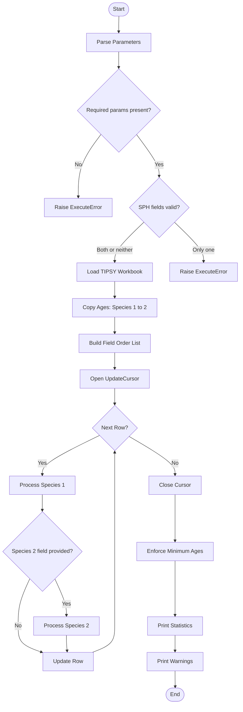
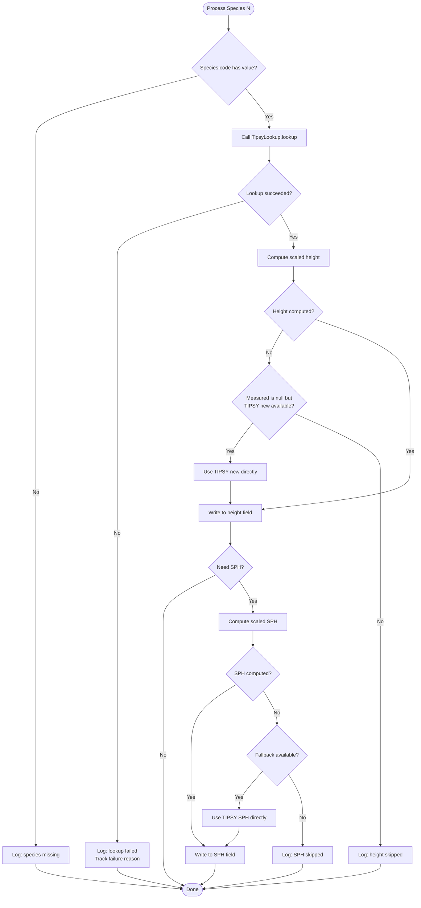
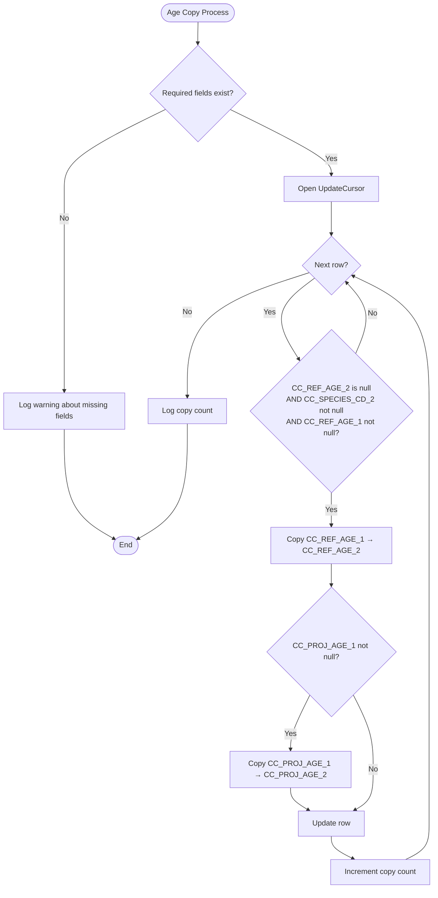
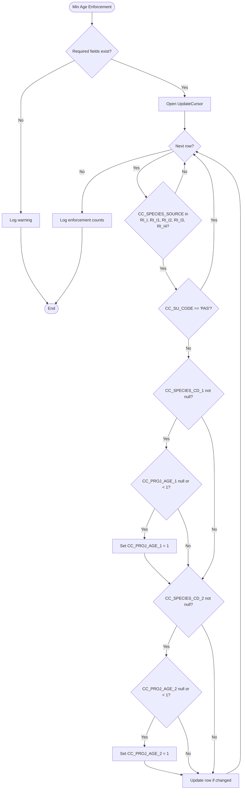

# CC_Step_3_grow_trees.py - Technical Reference

## Complete Documentation for the Tree Growth Projection Script

---

## Table of Contents

1. [Overview](#1-overview)
2. [Dependencies and Requirements](#2-dependencies-and-requirements)
3. [TIPSY Excel Workbook Structure](#3-tipsy-excel-workbook-structure)
4. [Core Classes and Functions](#4-core-classes-and-functions)
5. [The Scaling Algorithm](#5-the-scaling-algorithm)
6. [Processing Flow](#6-processing-flow)
7. [Parameter Reference](#7-parameter-reference)
8. [Error Handling and Failure Modes](#8-error-handling-and-failure-modes)
9. [Worked Examples](#9-worked-examples)
10. [Statistics and Logging](#10-statistics-and-logging)
11. [Troubleshooting](#11-troubleshooting)

---

## 1. Overview

### Purpose

`CC_Step_3_grow_trees.py` projects tree heights and stems per hectare (SPH) forward in time using TIPSY (Table Interpolation Program for Stand Yields) growth curves. This is **Step 3** of the 4-step Consolidated Cutblocks workflow.

### What It Does

The script takes forest inventory data with measured tree heights at a reference date and calculates what those heights will be at a projected future date. It does this by:

1. Reading growth curves from an Excel workbook containing TIPSY output tables
2. Looking up reference heights at both the original age and projected age
3. Calculating a scaling ratio between those two reference values
4. Applying that ratio to the actual measured height to get the projected height

### Why Scaling Instead of Direct Lookup?

Real forest stands don't perfectly match the "average" growth curves in TIPSY. Some stands grow faster, some slower, due to local conditions. By using a **ratio-based approach**, the script preserves each stand's relative performance:

```
If a stand is 10% taller than average at age 15,
it will still be approximately 10% taller than average at age 25.
```

### Context in the Workflow

```
┌─────────────────┐     ┌─────────────────┐     ┌─────────────────┐     ┌─────────────────┐
│                 │     │                 │     │                 │     │                 │
│   STEP 1        │────▶│   STEP 2        │────▶│   STEP 3        │────▶│   STEP 4        │
│   Create Layer  │     │   Add PAS       │     │   Grow Trees    │     │   Final Cleanup │
│                 │     │                 │     │   ◀── YOU ARE   │     │                 │
│                 │     │                 │     │       HERE      │     │                 │
└─────────────────┘     └─────────────────┘     └─────────────────┘     └─────────────────┘
```

### When to Use This Tool

- After Steps 1 and 2 of the Consolidated Cutblocks workflow
- On any forest inventory layer that has species, age, height, and site index fields
- When you need to project stand characteristics to a common reference date
- When comparing stands from different inventory years

---

## 2. Dependencies and Requirements

### Python Package Dependencies

```python
import arcpy                      # ArcGIS Pro geoprocessing library
from collections import defaultdict  # For statistics tracking
from openpyxl import load_workbook   # Excel file reading (REQUIRED)
```

### Installation Requirements

| Requirement | Details |
|-------------|---------|
| **ArcGIS Pro** | Version 2.x or 3.x with Python 3.x |
| **openpyxl** | Must be installed in the ArcGIS Python environment |
| **License** | Basic license is sufficient (no Advanced tools used) |

### Installing openpyxl

If openpyxl is not installed, the script will raise an error at import. To install:

```bash
# In ArcGIS Pro Python Command Prompt:
conda install openpyxl

# Or using pip:
pip install openpyxl
```

### Input Feature Class Requirements

The input feature class must contain the following fields (names are configurable via parameters):

| Field Purpose | Default Field Name | Data Type | Required |
|---------------|-------------------|-----------|----------|
| Species Code 1 | CC_SPECIES_CD_1 | Text | Yes |
| Reference Age 1 | CC_REF_AGE_1 | Integer/Double | Yes |
| Reference Height 1 | CC_REF_HEIGHT_1 | Double | Yes |
| Projected Age 1 | CC_PROJ_AGE_1 | Integer/Double | Yes |
| Projected Height 1 | CC_PROJ_HEIGHT_1 | Double | Yes |
| Site Index | RI_SITE_INDEX | Double | Yes |
| Reference SPH | CC_REF_STEMS_PER_HA | Integer/Double | Optional |
| Projected SPH | CC_PROJ_STEMS_PER_HA | Integer/Double | Optional |
| Species Code 2 | CC_SPECIES_CD_2 | Text | Optional |
| Reference Age 2 | CC_REF_AGE_2 | Integer/Double | Optional |
| Reference Height 2 | CC_REF_HEIGHT_2 | Double | Optional |
| Projected Age 2 | CC_PROJ_AGE_2 | Integer/Double | Optional |
| Projected Height 2 | CC_PROJ_HEIGHT_2 | Double | Optional |

### Additional Fields for Special Processing

These fields are used for the minimum age enforcement logic:

| Field Name | Purpose |
|------------|---------|
| CC_SPECIES_SOURCE | Determines if data came from RESULTS Inventory |
| CC_SU_CODE | Stand unit code (used to exclude PAS from age enforcement) |

---

## 3. TIPSY Excel Workbook Structure

The TIPSY lookup tables are stored in an Excel workbook with a specific structure that the script parses. Understanding this structure is critical for creating or modifying the workbook.

### Workbook Overview

```
┌────────────────────────────────────────────────────────────────────────────┐
│  Regen TIPSY Tables.xlsx                                                   │
│                                                                            │
│  ┌──────┬──────┬──────┬──────┬──────┬──────┬──────┬──────┬──────┐         │
│  │  Pl  │  Sx  │  Fd  │  Hw  │  Cw  │  Bl  │  At  │  Ep  │ ...  │ ◀─ Tabs │
│  └──────┴──────┴──────┴──────┴──────┴──────┴──────┴──────┴──────┘         │
│                                                                            │
│  Each tab = One species or species group                                   │
│  Each tab contains a growth curve table                                    │
└────────────────────────────────────────────────────────────────────────────┘
```

### Individual Sheet Structure

Each worksheet follows this exact layout:

```
┌─────┬─────────────────┬─────────────┬─────────────┬─────────────┬─────────────┬─────────────┬─────────────┐
│ Row │        A        │      B      │      C      │      D      │      E      │      F      │      G      │
├─────┼─────────────────┼─────────────┼─────────────┼─────────────┼─────────────┼─────────────┼─────────────┤
│  1  │    (empty)      │   (empty)   │   (empty)   │   (empty)   │   (empty)   │   (empty)   │   (empty)   │
├─────┼─────────────────┼─────────────┼─────────────┼─────────────┼─────────────┼─────────────┼─────────────┤
│  2  │    (empty)      │   (empty)   │   (empty)   │   (empty)   │   (empty)   │   (empty)   │   (empty)   │
├─────┼─────────────────┼─────────────┼─────────────┼─────────────┼─────────────┼─────────────┼─────────────┤
│  3  │  PL,PLI,PLC     │   (empty)   │   (empty)   │   (empty)   │   (empty)   │   (empty)   │   (empty)   │
│     │  ▲              │             │             │             │             │             │             │
│     │  Species codes  │             │             │             │             │             │             │
│     │  (comma-sep)    │             │             │             │             │             │             │
├─────┼─────────────────┼─────────────┼─────────────┼─────────────┼─────────────┼─────────────┼─────────────┤
│  4  │    (empty)      │   (empty)   │   (empty)   │   (empty)   │   (empty)   │   (empty)   │   (empty)   │
├─────┼─────────────────┼─────────────┼─────────────┼─────────────┼─────────────┼─────────────┼─────────────┤
│  5  │    (empty)      │     15      │   (empty)   │     20      │   (empty)   │     25      │   (empty)   │
│     │                 │     ▲       │             │     ▲       │             │     ▲       │             │
│     │                 │  SI upper   │             │  SI upper   │             │  SI upper   │             │
│     │                 │  bound      │             │  bound      │             │  bound      │             │
├─────┼─────────────────┼─────────────┼─────────────┼─────────────┼─────────────┼─────────────┼─────────────┤
│  6  │    (header)     │  (header)   │  (header)   │  (header)   │  (header)   │  (header)   │  (header)   │
├─────┼─────────────────┼─────────────┼─────────────┼─────────────┼─────────────┼─────────────┼─────────────┤
│  7  │       1         │    0.5      │    2000     │    0.6      │    2000     │    0.7      │    2000     │
│     │    ▲ Age        │  ▲ Height   │  ▲ SPH      │  ▲ Height   │  ▲ SPH      │  ▲ Height   │  ▲ SPH      │
│     │                 │  (SI 0-15)  │  (SI 0-15)  │  (SI 15-20) │  (SI 15-20) │  (SI 20-25) │  (SI 20-25) │
├─────┼─────────────────┼─────────────┼─────────────┼─────────────┼─────────────┼─────────────┼─────────────┤
│  8  │       2         │    0.8      │    1950     │    1.0      │    1950     │    1.2      │    1950     │
├─────┼─────────────────┼─────────────┼─────────────┼─────────────┼─────────────┼─────────────┼─────────────┤
│  9  │       3         │    1.2      │    1900     │    1.5      │    1900     │    1.8      │    1900     │
├─────┼─────────────────┼─────────────┼─────────────┼─────────────┼─────────────┼─────────────┼─────────────┤
│ 10  │       4         │    1.6      │    1850     │    2.0      │    1850     │    2.4      │    1850     │
├─────┼─────────────────┼─────────────┼─────────────┼─────────────┼─────────────┼─────────────┼─────────────┤
│ ... │      ...        │    ...      │    ...      │    ...      │    ...      │    ...      │    ...      │
├─────┼─────────────────┼─────────────┼─────────────┼─────────────┼─────────────┼─────────────┼─────────────┤
│ 56  │      50         │   18.5      │    800      │   22.0      │    800      │   25.5      │    800      │
├─────┼─────────────────┼─────────────┼─────────────┼─────────────┼─────────────┼─────────────┼─────────────┤
│ ... │      ...        │    ...      │    ...      │    ...      │    ...      │    ...      │    ...      │
├─────┼─────────────────┼─────────────┼─────────────┼─────────────┼─────────────┼─────────────┼─────────────┤
│106  │     100         │   28.0      │    450      │   33.0      │    450      │   38.0      │    450      │
└─────┴─────────────────┴─────────────┴─────────────┴─────────────┴─────────────┴─────────────┴─────────────┘
```

### Key Cell Locations

| Cell/Row | Content | How It's Used |
|----------|---------|---------------|
| **A3** | Species codes (comma-separated) | Mapped to this sheet for lookups |
| **Row 5** | Site Index upper bounds | Defines SI ranges for each column pair |
| **Column A (Row 7+)** | Age values (1, 2, 3, ... years) | Row lookup by age |
| **Columns B, D, F, ...** | Height values (meters) | Height lookup |
| **Columns C, E, G, ...** | SPH values (stems/ha) | SPH lookup |

### Site Index Range Logic

The script interprets Row 5 values as **upper bounds** for site index ranges:

```
Row 5 values:     15        20        25        30
                  │         │         │         │
                  ▼         ▼         ▼         ▼
SI Ranges:    [0-15)    [15-20)   [20-25)   [25-30)   [30+]
              Col B,C   Col D,E   Col F,G   Col H,I   ...

Examples:
- Site Index = 12  →  Falls in [0-15)   →  Use columns B (height) and C (SPH)
- Site Index = 18  →  Falls in [15-20)  →  Use columns D (height) and E (SPH)
- Site Index = 20  →  Falls in [20-25)  →  Use columns F (height) and G (SPH)
- Site Index = 35  →  Falls in [30+]    →  Use last available columns
```

### Column Pairing

Columns are processed in pairs: Height column followed by SPH column.

```
Column:    B      C       D      E       F      G       H      I
           │      │       │      │       │      │       │      │
           └──┬───┘       └──┬───┘       └──┬───┘       └──┬───┘
              │              │              │              │
           Pair 1         Pair 2         Pair 3         Pair 4
         (SI 0-15)      (SI 15-20)     (SI 20-25)     (SI 25-30)
```

---

## 4. Core Classes and Functions

### 4.1 TipsyLookup Class

The `TipsyLookup` class is the heart of the script. It loads the Excel workbook, builds an index of species-to-sheet mappings, and provides lookup methods.

#### Class Diagram

```
┌────────────────────────────────────────────────────────────────────┐
│                         TipsyLookup                                │
├────────────────────────────────────────────────────────────────────┤
│  Attributes:                                                       │
│  ─────────────────                                                 │
│  _wb: Workbook         # openpyxl workbook object                  │
│  _species_map: dict    # {species_code: profile_key}               │
│  _profiles: dict       # {profile_key: {sheet, site_ranges,        │
│                        #                age_rows}}                 │
├────────────────────────────────────────────────────────────────────┤
│  Methods:                                                          │
│  ─────────────────                                                 │
│  __init__(workbook_path)                                           │
│  _build_index()                                                    │
│  _parse_site_ranges(sheet) → list                                  │
│  _parse_age_rows(sheet) → dict                                     │
│  _get_profile(species_code) → dict or None                         │
│  _select_site_range(ranges, site_index) → dict or None             │
│  lookup(species_code, site_index, age_old, age_new, need_sph)      │
│         → (result_dict, error_code) or (None, error_code)          │
└────────────────────────────────────────────────────────────────────┘
```

#### 4.1.1 `__init__(self, workbook_path)`

**Purpose:** Initialize the lookup object by loading the Excel workbook.

```python
def __init__(self, workbook_path):
    self._wb = load_workbook(workbook_path, data_only=True)  # Load with values, not formulas
    self._species_map = {}   # Will map species codes to sheet names
    self._profiles = {}      # Will store parsed sheet data
    self._build_index()      # Parse all sheets
```

**Key Point:** The `data_only=True` parameter ensures that Excel formula cells return their calculated values, not the formula strings.

#### 4.1.2 `_build_index(self)`

**Purpose:** Parse every sheet in the workbook and build lookup indexes.

**Process:**
1. Iterate through all sheet names
2. For each sheet, read cell A3 to get species codes
3. Parse the codes (comma-separated, converted to uppercase)
4. Call `_parse_site_ranges()` and `_parse_age_rows()` to extract table structure
5. Store the sheet reference and parsed data in `_profiles`
6. Map each species code to its profile in `_species_map`

```
For each sheet:
    ┌─────────────────────────────────────────────────────────────────┐
    │  1. Read A3 → "PL,PLI,PLC"                                      │
    │  2. Split and uppercase → ["PL", "PLI", "PLC"]                  │
    │  3. Parse site ranges from Row 5 → [                            │
    │       {lower: 0, upper: 15, height_col: 2, sph_col: 3},         │
    │       {lower: 15, upper: 20, height_col: 4, sph_col: 5},        │
    │       ...                                                       │
    │     ]                                                           │
    │  4. Parse age rows → {1: 7, 2: 8, 3: 9, ..., 100: 106}         │
    │  5. Store profile with sheet reference                          │
    │  6. Map "PL" → profile, "PLI" → profile, "PLC" → profile       │
    └─────────────────────────────────────────────────────────────────┘
```

#### 4.1.3 `_parse_site_ranges(self, sheet) → list`

**Purpose:** Extract site index breakpoints and column mappings from Row 5.

**Returns:** A list of dictionaries, each containing:
- `lower`: Lower bound of SI range (inclusive)
- `upper`: Upper bound of SI range (exclusive, except for last range)
- `height_col`: Column number for height values (1-based)
- `sph_col`: Column number for SPH values (1-based), or None

```python
# Example return value:
[
    {"lower": 0.0,  "upper": 15.0, "height_col": 2, "sph_col": 3},
    {"lower": 15.0, "upper": 20.0, "height_col": 4, "sph_col": 5},
    {"lower": 20.0, "upper": 25.0, "height_col": 6, "sph_col": 7},
    {"lower": 25.0, "upper": 30.0, "height_col": 8, "sph_col": 9},
]
```

**Algorithm:**
```
start at column 2 (B)
lower_bound = 0.0

while cell at (row 5, column) has a value:
    upper_bound = cell value
    sph_col = column + 1 if that cell also has a value
    
    add {lower, upper, height_col: column, sph_col} to list
    
    lower_bound = upper_bound
    column += 2  (skip to next Height column)
```

#### 4.1.4 `_parse_age_rows(self, sheet) → dict`

**Purpose:** Build a mapping from age values to Excel row numbers.

**Returns:** A dictionary mapping integer ages to row numbers.

```python
# Example return value:
{
    1: 7,    # Age 1 is in row 7
    2: 8,    # Age 2 is in row 8
    3: 9,
    # ...
    50: 56,
    # ...
    100: 106
}
```

**Algorithm:**
```
start at row 7
age_rows = {}

while cell at (row, column A) has a value:
    age = integer value of cell
    age_rows[age] = row
    row += 1
    
return age_rows
```

#### 4.1.5 `_get_profile(self, species_code) → dict or None`

**Purpose:** Retrieve the parsed profile for a given species code.

**Process:**
1. Convert species code to uppercase
2. Look up in `_species_map` to get profile name
3. Return the profile from `_profiles`, or None if not found

#### 4.1.6 `_select_site_range(ranges, site_index) → dict or None`

**Purpose:** Find the appropriate site index band for a given SI value.

**Static method** - can be called without an instance.

**Algorithm:**
```
for each band in ranges:
    if this is the LAST band:
        if site_index >= band.lower:
            return band
    else:
        if band.lower <= site_index < band.upper:
            return band

return None  # site_index out of range
```

**Edge Case Handling:**
- The last band includes all values >= its lower bound (no upper limit)
- This ensures very high SI values still get a valid lookup

#### 4.1.7 `lookup(self, species_code, site_index, age_old, age_new, need_sph=False)`

**Purpose:** The main lookup method. Returns height (and optionally SPH) values at both old and new ages.

**Parameters:**
| Parameter | Type | Description |
|-----------|------|-------------|
| `species_code` | str | Tree species code (e.g., "PLI") |
| `site_index` | float | Site productivity index |
| `age_old` | int | Reference/current age |
| `age_new` | int | Projected/target age |
| `need_sph` | bool | Whether to also look up SPH values |

**Returns:** A tuple of `(result_dict, error_code)`:

**Success case:**
```python
(
    {
        "height_old": 9.0,    # Height at age_old
        "height_new": 14.5,   # Height at age_new
        "sph_old": 1200,      # SPH at age_old (if need_sph=True)
        "sph_new": 950,       # SPH at age_new (if need_sph=True)
    },
    None  # No error
)
```

**Failure case:**
```python
(None, "error_code")
```

**Lookup Process Flow:**

```
┌─────────────────────────────────────────────────────────────────┐
│  INPUT: species="PLI", site_index=18, age_old=15, age_new=25    │
└───────────────────────────┬─────────────────────────────────────┘
                            │
                            ▼
┌─────────────────────────────────────────────────────────────────┐
│  1. Get profile for "PLI"                                       │
│     → Found: profile for "Pl" sheet                             │
│     (If not found, return None, "no_profile")                   │
└───────────────────────────┬─────────────────────────────────────┘
                            │
                            ▼
┌─────────────────────────────────────────────────────────────────┐
│  2. Validate site_index                                         │
│     → site_index=18 is valid                                    │
│     (If None, return None, "null_site_index")                   │
└───────────────────────────┬─────────────────────────────────────┘
                            │
                            ▼
┌─────────────────────────────────────────────────────────────────┐
│  3. Find site index band                                        │
│     → SI 18 falls in range [15, 20)                             │
│     → height_col=4, sph_col=5                                   │
│     (If no band, return None, "site_index_out_of_range")        │
└───────────────────────────┬─────────────────────────────────────┘
                            │
                            ▼
┌─────────────────────────────────────────────────────────────────┐
│  4. Validate ages                                               │
│     → age_old=15, age_new=25 are valid                          │
│     (If None, return None, "null_age")                          │
└───────────────────────────┬─────────────────────────────────────┘
                            │
                            ▼
┌─────────────────────────────────────────────────────────────────┐
│  5. Get row numbers for ages                                    │
│     → age 15 is in row 21, age 25 is in row 31                  │
│     (If age not in table, return None, "age_out_of_range")      │
└───────────────────────────┬─────────────────────────────────────┘
                            │
                            ▼
┌─────────────────────────────────────────────────────────────────┐
│  6. Read cell values                                            │
│     → sheet.cell(row=21, column=4) → height_old = 9.0           │
│     → sheet.cell(row=31, column=4) → height_new = 14.5          │
│     → If need_sph:                                              │
│         sheet.cell(row=21, column=5) → sph_old = 1200           │
│         sheet.cell(row=31, column=5) → sph_new = 950            │
└───────────────────────────┬─────────────────────────────────────┘
                            │
                            ▼
┌─────────────────────────────────────────────────────────────────┐
│  7. Return result                                               │
│     → {"height_old": 9.0, "height_new": 14.5,                   │
│        "sph_old": 1200, "sph_new": 950}, None                   │
└─────────────────────────────────────────────────────────────────┘
```

---

### 4.2 Helper Functions

#### 4.2.1 `_safe_float(value) → float or None`

Safely converts a value to float, returning None on failure.

```python
def _safe_float(value):
    try:
        return float(value)
    except (TypeError, ValueError):
        return None
```

**Use Cases:**
- Converting Excel cell values that might be None
- Handling text values in numeric fields
- Preventing crashes from bad data

#### 4.2.2 `_safe_int(value) → int or None`

Safely converts a value to integer (with rounding), returning None on failure.

```python
def _safe_int(value):
    try:
        return int(round(float(value)))
    except (TypeError, ValueError):
        return None
```

**Note:** Uses `round()` before `int()` to handle float values like 15.0 correctly.

#### 4.2.3 `_compute_scaled_value(old_reference, new_reference, measured_old) → float or None`

The core scaling calculation.

```python
def _compute_scaled_value(old_reference, new_reference, measured_old):
    if old_reference in (None, 0) or new_reference is None or measured_old is None:
        return None
    return (new_reference / old_reference) * measured_old
```

**Mathematical Formula:**

```
                    TIPSY_new
Projected Value = ─────────── × Measured_old
                    TIPSY_old
```

**Guard Conditions:**
- Returns None if `old_reference` is None or 0 (prevents division by zero)
- Returns None if `new_reference` is None
- Returns None if `measured_old` is None

#### 4.2.4 `_fmt(value) → str`

Formats values for log messages.

```python
def _fmt(value):
    if value is None:
        return 'None'
    if isinstance(value, float):
        return f"{value:.3f}"
    return str(value)
```

---

## 5. The Scaling Algorithm

### 5.1 The Core Formula

The script uses proportional scaling to project tree heights:

```
                        TIPSY Height at New Age
Projected Height = ───────────────────────────── × Measured Height at Old Age
                        TIPSY Height at Old Age
```

Or more compactly:

```
                   H_tipsy(age_new)
H_projected = ─────────────────────── × H_measured
                   H_tipsy(age_old)
```

### 5.2 Why Scaling Works

Consider this example:

| Value | Description |
|-------|-------------|
| TIPSY height at age 15 | 9.0 m (reference for "average" stand) |
| Measured height at age 15 | 8.5 m (actual stand, slightly below average) |
| TIPSY height at age 25 | 14.5 m (reference for "average" stand) |

**If we used TIPSY value directly:**
- Projected height = 14.5 m
- **Problem:** This assumes the stand is average, but it's actually below average

**Using scaling:**
- Ratio = 14.5 / 9.0 = 1.611
- Projected height = 1.611 × 8.5 = 13.7 m
- **This preserves the stand's relative position** (still below average)

### 5.3 Visual Representation

```
Height (m)
    │
 20 │                                            ▲ TIPSY curve
    │                                        ▲
    │                                    ▲
 15 │                              ●─────────────● 14.5 (TIPSY)
    │                          ▲   │
    │                      ▲       │
 10 │                  ▲           │  ○─────────○ 13.7 (Projected)
    │              ●─────────────● 9.0 (TIPSY)
    │          ▲   │               │
  5 │      ▲       ○───────────○ 8.5 (Measured)
    │  ▲           
    │
    └────────────────────────────────────────────────► Age
              15              25

Legend:
● ── ● = TIPSY reference values
○ ── ○ = Actual stand values (measured → projected)
▲     = TIPSY growth curve
```

The ratio between TIPSY values at age 15 and 25 is applied to scale the measured value.

### 5.4 SPH Scaling

Stems per hectare (SPH) uses the same formula:

```
                   SPH_tipsy(age_new)
SPH_projected = ───────────────────────── × SPH_measured
                   SPH_tipsy(age_old)
```

**Note:** SPH typically **decreases** over time due to natural mortality, so the ratio is usually < 1.

### 5.5 Fallback Behavior

When the measured (old) value is null but TIPSY values are available, the script uses the TIPSY new value directly:

```python
# If scaling failed because old height is null, use TIPSY height_new directly
if new_height is None and measured_height_old is None and result["height_new"] is not None:
    new_height = result["height_new"]
```

**Use Case:** When inventory data is missing height measurements but you still want projections based on species/SI/age.

---

## 6. Processing Flow

### 6.1 Main Processing Flow



### 6.2 Species Processing Detail



### 6.3 Age Copying Process

Before the main TIPSY lookup loop, ages are copied from species 1 to species 2 when needed:



### 6.4 Minimum Age Enforcement

After the main processing, minimum ages are enforced for RESULTS Inventory data:



---

## 7. Parameter Reference

The script accepts 15 parameters, either via ArcGIS toolbox or direct function call.

### Parameter Table

| Index | Name | Type | Required | Default | Description |
|-------|------|------|----------|---------|-------------|
| 0 | input_fc | Feature Layer | Yes | - | Input feature class to update |
| 1 | tipsy_table | File | Yes | - | Path to TIPSY Excel workbook |
| 2 | species_field_1 | Field | Yes | CC_SPECIES_CD_1 | Species code field for layer 1 |
| 3 | age_field_old_1 | Field | Yes | CC_REF_AGE_1 | Current age field for layer 1 |
| 4 | height_field_old_1 | Field | Yes | CC_REF_HEIGHT_1 | Current height field for layer 1 |
| 5 | age_field_new_1 | Field | Yes | CC_PROJ_AGE_1 | Projected age field for layer 1 |
| 6 | height_field_new_1 | Field | Yes | CC_PROJ_HEIGHT_1 | Projected height field (OUTPUT) for layer 1 |
| 7 | sph_old_field | Field | Optional* | CC_REF_STEMS_PER_HA | Current SPH field |
| 8 | sph_new_field | Field | Optional* | CC_PROJ_STEMS_PER_HA | Projected SPH field (OUTPUT) |
| 9 | species_field_2 | Field | Optional | CC_SPECIES_CD_2 | Species code field for layer 2 |
| 10 | age_field_old_2 | Field | Optional | CC_REF_AGE_2 | Current age field for layer 2 |
| 11 | height_field_old_2 | Field | Optional | CC_REF_HEIGHT_2 | Current height field for layer 2 |
| 12 | age_field_new_2 | Field | Optional | CC_PROJ_AGE_2 | Projected age field for layer 2 |
| 13 | height_field_new_2 | Field | Optional | CC_PROJ_HEIGHT_2 | Projected height field (OUTPUT) for layer 2 |
| 14 | site_index_field | Field | Yes | RI_SITE_INDEX | Site index field |

*SPH fields must be provided together (both or neither).

### Parameter Validation Rules

1. **Required Parameters:** Parameters 0-6 and 14 must all be provided
2. **SPH Pairing:** If either SPH field (7 or 8) is provided, both must be provided
3. **Layer 2 Independence:** Layer 2 fields are fully optional and processed only if species_field_2 has a value

### Calling the Script

**From ArcGIS Toolbox:**
Parameters are passed via the tool interface and retrieved using `arcpy.GetParameterAsText()`.

**Direct Python Call:**
```python
import CC_Step_3_grow_trees

CC_Step_3_grow_trees.main(
    r"C:\Data\Cutblocks.gdb\CC_Layer",      # input_fc
    r"C:\Data\Regen TIPSY Tables.xlsx",      # tipsy_table
    "CC_SPECIES_CD_1",                        # species_field_1
    "CC_REF_AGE_1",                           # age_field_old_1
    "CC_REF_HEIGHT_1",                        # height_field_old_1
    "CC_PROJ_AGE_1",                          # age_field_new_1
    "CC_PROJ_HEIGHT_1",                       # height_field_new_1
    "CC_REF_STEMS_PER_HA",                    # sph_old_field
    "CC_PROJ_STEMS_PER_HA",                   # sph_new_field
    "CC_SPECIES_CD_2",                        # species_field_2
    "CC_REF_AGE_2",                           # age_field_old_2
    "CC_REF_HEIGHT_2",                        # height_field_old_2
    "CC_PROJ_AGE_2",                          # age_field_new_2
    "CC_PROJ_HEIGHT_2",                       # height_field_new_2
    "RI_SITE_INDEX"                           # site_index_field
)
```

---

## 8. Error Handling and Failure Modes

### 8.1 Import-Time Errors

| Error | Cause | Solution |
|-------|-------|----------|
| `openpyxl is required...` | openpyxl package not installed | Install via `conda install openpyxl` |

### 8.2 Parameter Validation Errors

| Error | Cause | Solution |
|-------|-------|----------|
| `Missing required parameters: ...` | One or more required parameters empty | Provide all required parameters |
| `Both SPH fields must be provided...` | Only one SPH field provided | Provide both SPH fields or neither |

### 8.3 Lookup Error Codes

The `lookup()` method returns error codes explaining why a lookup failed:

| Error Code | Meaning | Cause | Resolution |
|------------|---------|-------|------------|
| `no_profile` | Species not found | Species code not in any sheet's A3 cell | Add species code to appropriate sheet |
| `null_site_index` | Site index is null | The site index field is empty for this row | Populate site index data |
| `site_index_out_of_range` | SI outside defined bands | Site index value doesn't fit any column range | Extend SI ranges in workbook |
| `null_age` | Age value is null | Either old age or new age field is empty | Populate age fields |
| `age_out_of_range` | Age not in lookup table | Age value doesn't have a corresponding row | Extend age range in workbook |

### 8.4 Error Tracking

The script tracks all failures and reports them at the end:

```python
failure_reasons = defaultdict(lambda: defaultdict(int))

# After each failed lookup:
failure_reasons["species1"][f"{species_value}:{error}"] += 1

# At end of processing:
for reason_key, count in failure_reasons["species1"].items():
    species, reason = reason_key.split(":", 1)
    arcpy.AddMessage(f"  {species}: {count} failures due to '{reason}'")
```

**Example Output:**
```
Species 1 failure breakdown:
  EP: 45 failures due to 'no_profile'
  AC: 12 failures due to 'age_out_of_range'
  DR: 8 failures due to 'null_site_index'
```

---

## 9. Worked Examples

### 9.1 Complete Example: Height Projection

**Input Data (Feature Class Row):**

| Field | Value |
|-------|-------|
| CC_SPECIES_CD_1 | PLI |
| CC_REF_AGE_1 | 15 |
| CC_REF_HEIGHT_1 | 8.5 |
| CC_PROJ_AGE_1 | 25 |
| RI_SITE_INDEX | 18 |

**TIPSY Workbook Data (Pl Sheet):**

Cell A3: `PL,PLI,PLC`

Row 5: `15, 20, 25, 30` (SI breakpoints)

| Row | Age (Col A) | Height SI 15-20 (Col D) | SPH SI 15-20 (Col E) |
|-----|-------------|-------------------------|----------------------|
| 21 | 15 | 9.0 | 1200 |
| 31 | 25 | 14.5 | 950 |

**Step-by-Step Calculation:**

```
1. Species Lookup:
   "PLI" → Found in Pl sheet (A3 contains "PL,PLI,PLC")

2. Site Index Band Selection:
   SI = 18
   Row 5 values: 15, 20, 25, 30
   18 falls in range [15, 20)
   → Use columns D (height) and E (SPH)

3. Age Row Lookup:
   Age 15 → Row 21
   Age 25 → Row 31

4. Read TIPSY Values:
   height_old = Cell(21, D) = 9.0 m
   height_new = Cell(31, D) = 14.5 m

5. Calculate Scaling Ratio:
   ratio = 14.5 / 9.0 = 1.6111

6. Apply to Measured Value:
   projected_height = 1.6111 × 8.5 = 13.694 m

7. Round to 1 decimal:
   CC_PROJ_HEIGHT_1 = 13.7 m
```

**Log Output:**
```
OID 42: height1 scaled 8.500 -> 13.700 (tipsy 9.000 -> 14.500) for species 'PLI'.
```

### 9.2 Example: SPH Projection

**Additional Input Data:**

| Field | Value |
|-------|-------|
| CC_REF_STEMS_PER_HA | 1350 |

**Calculation:**

```
1. TIPSY SPH Values (from same lookup):
   sph_old = Cell(21, E) = 1200
   sph_new = Cell(31, E) = 950

2. Calculate Scaling Ratio:
   ratio = 950 / 1200 = 0.7917

3. Apply to Measured Value:
   projected_sph = 0.7917 × 1350 = 1068.75

4. Result (no rounding):
   CC_PROJ_STEMS_PER_HA = 1068.75
```

**Log Output:**
```
OID 42: sph scaled 1350.000 -> 1068.750 (tipsy 1200.000 -> 950.000).
```

### 9.3 Example: Fallback When Measured Height is Null

**Input Data:**

| Field | Value |
|-------|-------|
| CC_SPECIES_CD_1 | PLI |
| CC_REF_AGE_1 | 15 |
| CC_REF_HEIGHT_1 | **NULL** |
| CC_PROJ_AGE_1 | 25 |
| RI_SITE_INDEX | 18 |

**Calculation:**

```
1. TIPSY Lookup succeeds:
   height_old = 9.0
   height_new = 14.5

2. Scaling attempt:
   _compute_scaled_value(9.0, 14.5, None) → None
   (measured_old is None)

3. Fallback check:
   measured_height_old is None: True
   result["height_new"] is not None: True (14.5)

4. Apply fallback:
   CC_PROJ_HEIGHT_1 = 14.5 m  (TIPSY value used directly)
```

**Log Output:**
```
OID 42: height1 scaled None -> 14.500 (tipsy 9.000 -> 14.500) for species 'PLI'.
```

### 9.4 Example: Secondary Species with Age Copy

**Input Data (Before Processing):**

| Field | Value |
|-------|-------|
| CC_SPECIES_CD_1 | PLI |
| CC_REF_AGE_1 | 20 |
| CC_PROJ_AGE_1 | 30 |
| CC_SPECIES_CD_2 | SX |
| CC_REF_AGE_2 | **NULL** |
| CC_PROJ_AGE_2 | **NULL** |

**Age Copy Phase:**

```
Condition check:
- CC_REF_AGE_2 is null: True
- CC_SPECIES_CD_2 is not null: True ("SX")
- CC_REF_AGE_1 is not null: True (20)

Action:
- CC_REF_AGE_2 = 20 (copied from CC_REF_AGE_1)
- CC_PROJ_AGE_2 = 30 (copied from CC_PROJ_AGE_1)
```

**After Age Copy:**

| Field | Value |
|-------|-------|
| CC_REF_AGE_2 | 20 |
| CC_PROJ_AGE_2 | 30 |

Now the TIPSY lookup for species 2 can proceed with valid age values.

### 9.5 Example: Minimum Age Enforcement

**Input Data:**

| Field | Value |
|-------|-------|
| CC_SPECIES_SOURCE | RI_I |
| CC_SU_CODE | PRODUCTIVE |
| CC_SPECIES_CD_1 | PLI |
| CC_PROJ_AGE_1 | 0 |
| CC_SPECIES_CD_2 | SX |
| CC_PROJ_AGE_2 | NULL |

**Enforcement Check:**

```
1. CC_SPECIES_SOURCE = "RI_I" 
   → Is in ('RI_I', 'RI_I1', 'RI_I2', 'RI_I3', 'RI_I4'): True

2. CC_SU_CODE = "PRODUCTIVE"
   → Is not 'PAS': True

3. Species 1 check:
   CC_SPECIES_CD_1 is not null: True
   CC_PROJ_AGE_1 < 1: True (0 < 1)
   → Set CC_PROJ_AGE_1 = 1

4. Species 2 check:
   CC_SPECIES_CD_2 is not null: True
   CC_PROJ_AGE_2 is null: True
   → Set CC_PROJ_AGE_2 = 1
```

**After Enforcement:**

| Field | Value |
|-------|-------|
| CC_PROJ_AGE_1 | 1 |
| CC_PROJ_AGE_2 | 1 |

---

## 10. Statistics and Logging

### 10.1 Statistics Tracked

The script maintains a `stats` dictionary with the following counters:

| Statistic Key | Description |
|---------------|-------------|
| `height1_success` | Number of successful height 1 projections |
| `height1_skipped` | Number of skipped height 1 projections |
| `sph_success` | Number of successful SPH projections |
| `sph_skipped` | Number of skipped SPH projections |
| `height2_success` | Number of successful height 2 projections |
| `height2_skipped` | Number of skipped height 2 projections |
| `species1_lookup_failed` | Number of failed lookups for species 1 |
| `species1_missing` | Number of rows with no species 1 value |
| `species2_lookup_failed` | Number of failed lookups for species 2 |
| `species2_missing` | Number of rows with no species 2 value |

### 10.2 Per-Row Log Messages

**Successful Height Projection:**
```
OID 42: height1 scaled 8.500 -> 13.700 (tipsy 9.000 -> 14.500) for species 'PLI'.
```

**Skipped Height (No Result):**
```
OID 42: height1 update skipped for species 'PLI' (tipsy old=9.000, new=14.500, measured=None).
```

**Failed Lookup:**
```
OID 42: lookup failed for species 'EP' with site index 18.000, age_old 15, age_new 25.
```

**Missing Species:**
```
OID 42: no value in field CC_SPECIES_CD_1; skipping height1/SPH.
```

**Missing Site Index:**
```
OID 42: missing site index value; skipping workbook lookup.
```

### 10.3 Summary Statistics Output

At the end of processing:

```
Height 1 updates: 1523 successful, 45 skipped
SPH updates: 1498 successful, 70 skipped
Height 2 updates: 892 successful, 156 skipped
```

### 10.4 Warning Messages

For species that couldn't be looked up:

```
WARNING: No lookup found for species 1 codes: AC, DR, EP, YC

Species 1 failure breakdown:
  AC: 12 failures due to 'age_out_of_range'
  DR: 8 failures due to 'null_site_index'
  EP: 45 failures due to 'no_profile'
  YC: 23 failures due to 'no_profile'
```

### 10.5 Age Copy Logging

```
Copying ages from species 1 to species 2 where CC_REF_AGE_2 is null...
Copied ages from species 1 to species 2 for 234 features (null CC_REF_AGE_2 with species 2)
```

### 10.6 Minimum Age Enforcement Logging

```
Enforcing minimum projected ages for RESULTS_Inv species data...
Minimum projected age (1) enforced for 12 CC_PROJ_AGE_1 and 8 CC_PROJ_AGE_2 features
```

---

## 11. Troubleshooting

### 11.1 Common Issues and Solutions

| Issue | Symptom | Solution |
|-------|---------|----------|
| Species not found | "No lookup found for species code: XX" | Add the species code to cell A3 of the appropriate TIPSY sheet |
| Site index out of range | High SI values return no lookup | Extend the SI breakpoints in Row 5 of the TIPSY sheet |
| Age out of range | Ages > 100 return no lookup | Extend the age rows in the TIPSY sheet beyond row 106 |
| Zero/negative heights | Unexpected results | Check that TIPSY values are non-zero for the age range |
| No output changes | Fields not updating | Verify field names match exactly (case-sensitive) |

### 11.2 Debugging Checklist

1. **Verify TIPSY Workbook Structure:**
   - Cell A3 contains species codes (comma-separated)
   - Row 5 contains SI breakpoints in columns B, D, F, etc.
   - Age values start in A7 and continue without gaps
   - Height/SPH values are numeric (not formulas returning errors)

2. **Check Input Data:**
   - Species codes match TIPSY sheet codes (case-insensitive)
   - Site index values are within the defined ranges
   - Age values are within the TIPSY table range (typically 1-100)
   - Required fields exist with correct data types

3. **Review Log Output:**
   - Check for "lookup failed" messages and their reasons
   - Review the failure breakdown by species
   - Note any "missing site index" messages

### 11.3 Workbook Validation

To verify your TIPSY workbook is correctly formatted:

```python
from openpyxl import load_workbook

wb = load_workbook("path/to/TIPSY.xlsx", data_only=True)

for sheet_name in wb.sheetnames:
    sheet = wb[sheet_name]
    print(f"\nSheet: {sheet_name}")
    print(f"  A3 (species): {sheet['A3'].value}")
    
    # Check Row 5 for SI breakpoints
    col = 2
    si_values = []
    while sheet.cell(row=5, column=col).value is not None:
        si_values.append(sheet.cell(row=5, column=col).value)
        col += 2
    print(f"  SI breakpoints: {si_values}")
    
    # Check age range
    first_age = sheet.cell(row=7, column=1).value
    last_row = 7
    while sheet.cell(row=last_row + 1, column=1).value is not None:
        last_row += 1
    last_age = sheet.cell(row=last_row, column=1).value
    print(f"  Age range: {first_age} to {last_age}")
```

### 11.4 Performance Considerations

| Factor | Impact | Recommendation |
|--------|--------|----------------|
| Workbook size | Initial load time | Keep unused sheets minimal |
| Feature count | Processing time | Process in batches for very large datasets |
| Log verbosity | I/O overhead | Consider reducing per-row logging for production |

---

## Appendix A: Species Code Reference

Common BC species codes that should be in the TIPSY workbook:

| Code | Full Name | Common Grouping |
|------|-----------|-----------------|
| PL, PLI | Lodgepole Pine (Interior) | Pine |
| PLC | Lodgepole Pine (Coastal) | Pine |
| PY | Ponderosa Pine | Pine |
| PW | Western White Pine | Pine |
| SX | Spruce Hybrid | Spruce |
| SE | Engelmann Spruce | Spruce |
| SW | White Spruce | Spruce |
| SS | Sitka Spruce | Spruce |
| FD, FDI | Douglas-fir (Interior) | Douglas-fir |
| FDC | Douglas-fir (Coastal) | Douglas-fir |
| HW | Western Hemlock | Hemlock |
| HM | Mountain Hemlock | Hemlock |
| CW | Western Red Cedar | Cedar |
| YC | Yellow Cedar | Cedar |
| BL | Subalpine Fir | True Fir |
| BA | Amabilis Fir | True Fir |
| BG | Grand Fir | True Fir |
| LW | Western Larch | Larch |
| AT | Trembling Aspen | Deciduous |
| AC, ACT | Cottonwood | Deciduous |
| EP | Paper Birch | Deciduous |
| DR | Red Alder | Deciduous |
| MB | Bigleaf Maple | Deciduous |

---

## Appendix B: Mathematical Summary

### Height Projection

```
H_proj = H_measured × (H_tipsy_new / H_tipsy_old)
```

Where:
- `H_proj` = Projected height (output)
- `H_measured` = Measured height at reference date
- `H_tipsy_new` = TIPSY height at projected age
- `H_tipsy_old` = TIPSY height at reference age

### SPH Projection

```
SPH_proj = SPH_measured × (SPH_tipsy_new / SPH_tipsy_old)
```

### Scaling Ratio Interpretation

```
ratio = value_new / value_old

If ratio > 1: Value increases with age (typical for height)
If ratio < 1: Value decreases with age (typical for SPH)
If ratio = 1: No change
```

---

*Document Version: 1.0*
*Last Updated: January 2026*
*Based on CC_Step_3_grow_trees.py analysis*
